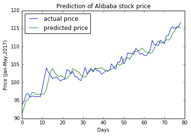

# stock_forecast

 This is a somewhat cursory script for stock price forecasting using the deep learning recurrent network called <a href='http://colah.github.io/posts/2015-08-Understanding-LSTMs/'>LSTM</a>. Just a quick background on this little project - I am not an expert by any means in stock or investing, the closest I've come to predict future trends is by using fundamental metrics like MACD and Stochastic Oscillator. After learning about LSTM neural network from Kirill Eremenko's Udemy class <a href="https://www.udemy.com/deeplearning/learn/v4/overview"<i> Deep Learning A-Z </i></a>, I decided to try out one of the homework problems in using LSTM to predict time-series data (stock prices), curious to see if there's any practical value of applying recurrent neural network.

 In this predictive model, one hyperparameter of interest is the number of days of prior stock prices used in each sample point. After some preliminary exploration, 3 day of past prices was used. This means that for any given day Xi in the training set, it contains a vector of Yi-2, Yi-1, Yi corresponding to the closing prices of the last three days. The LSTM model will take this input (with timestep of 3 specified), and yield an output prediction for the next day, Xi+1. From an intuitive point of view, the optimal prior days of data would be different depending on the stock, some stocks fluctuate more due to daily happenings of the world, thus their pricings would reflect heavy weights/importance on the closing price of the most recent day(s) before. As shown in Fig 1. below, the predicted price has a tendency to lag behind, and this lag was more pronounced when 10 prior days of stock prices were used in the model. However, this stacked LSTM model seem to be useful in general forecast for a window of 20 days or greater into the future.

 Fig 1. Plot of predicted and actual prices using validation data set for ticker BABA

